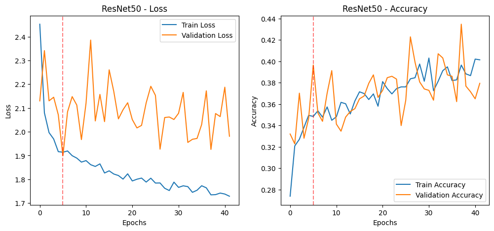
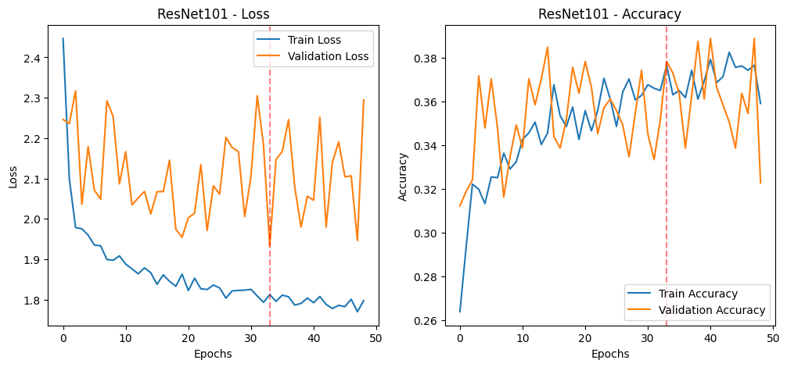
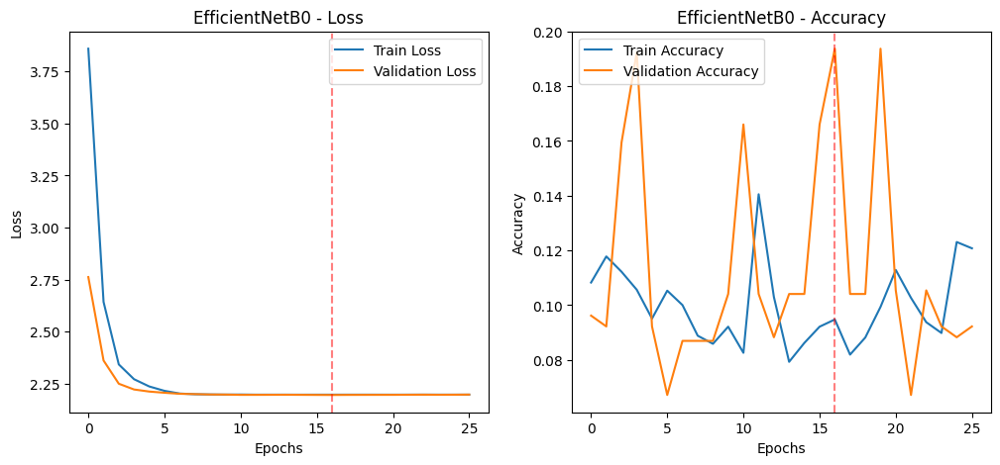
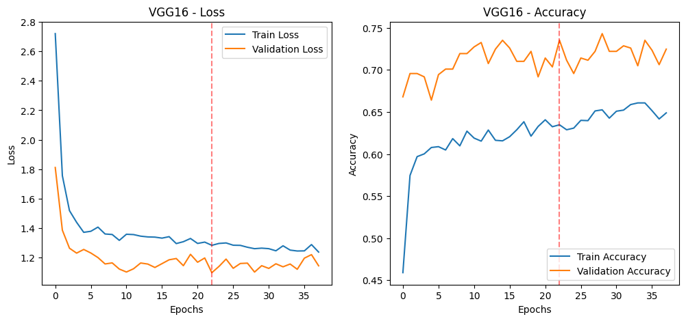

# CNN Image Classification on CIFAR-10

This project implements a **Convolutional Neural Network (CNN)** using TensorFlow and Keras to classify images from the **CIFAR-10 dataset**, a benchmark dataset for computer vision tasks.

## Project Overview

- **Dataset**: CIFAR-10 — 60,000 32x32 color images in 10 classes  
- **Goal**: Classify unseen test images into their correct categories  
- **Approach**: Build and train a CNN with multiple convolutional and pooling layers  
- **Evaluation**: Accuracy, loss curves, and misclassification analysis  

## Model Architecture

- Input: 32x32 RGB image  
- Convolutional layers with ReLU activation  
- MaxPooling layers  
- Dropout for regularization  
- Dense layers leading to softmax output  

## Results

- Achieved ~70% accuracy on test data  
- Visualized training vs. validation loss and accuracy  
- Demonstrated the effect of batch size and learning rate  
- Analyzed correct and incorrect predictions to assess model generalization

### Model Performance Comparison

| Model           | Stage | Precision | Recall  | F1 Score | AUC    |
|----------------|-------|-----------|---------|----------|--------|
| ResNet50        | Train | 0.4893    | 0.4525  | 0.4305   | 0.8418 |
|                 | Val   | 0.4394    | 0.4229  | 0.3957   | 0.8100 |
|                 | Test  | 0.3966    | 0.3658  | 0.3323   | 0.7897 |
| **ResNet101**   | Train | 0.4525    | 0.4153  | 0.3961   | 0.8279 |
|                 | Val   | 0.3934    | 0.3781  | 0.3522   | 0.8065 |
|                 | Test  | 0.3643    | 0.3585  | 0.3249   | 0.7838 |
| EfficientNetB0  | Train | 0.0277    | 0.1665  | 0.0475   | 0.5000 |
|                 | Val   | 0.0276    | 0.1660  | 0.0473   | 0.4996 |
|                 | Test  | 0.0274    | 0.1656  | 0.0471   | 0.5002 |
| **VGG16**       | Train | **0.7832**| **0.7730** | **0.7750** | **0.9739** |
|                 | Val   | 0.7398    | 0.7352  | 0.7354   | 0.9613 |
|                 | Test  | 0.6558    | 0.6457  | 0.6482   | 0.9412 |

> **Best Model:** `VGG16` with a test F1 score of **0.6482**

## Concepts Applied

- CNNs and deep learning fundamentals  
- Image preprocessing and normalization  
- Model evaluation and overfitting prevention  
- Tuning optimizers, batch sizes, and epochs

## Technologies Used

- Python  
- TensorFlow & Keras  
- NumPy  
- Matplotlib / Seaborn

## Sample Visuals

### ResNet50

<em>Training and validation loss/accuracy for ResNet50.</em>

### ResNet101

<em>Training and validation loss/accuracy for ResNet101.</em>

### EfficientNetB0

<em>Training and validation loss/accuracy for EfficientNetB0.</em>

### VGG16

<em>Training and validation loss/accuracy for VGG16 – the best-performing model.</em>

## License
MIT License